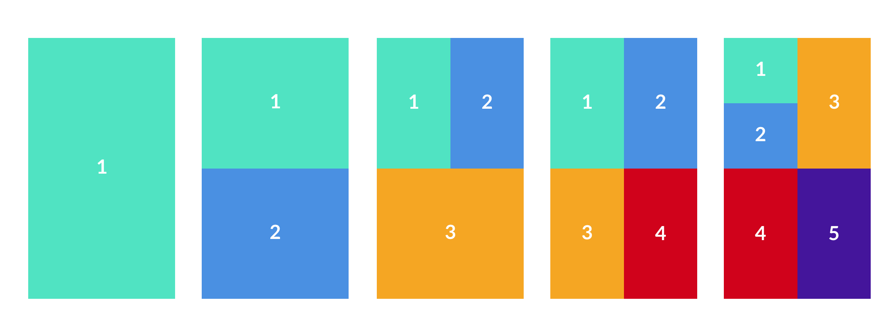
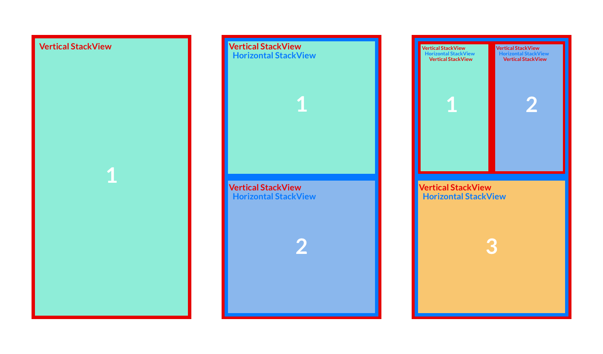
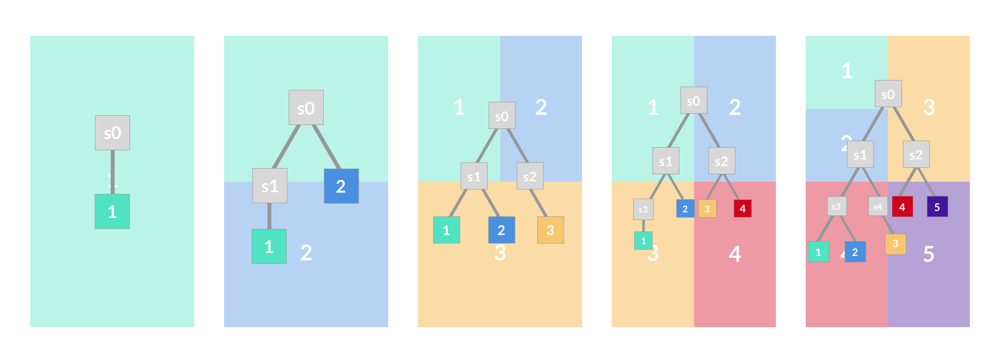

#Implementation
If you try to take a look and understand the code, you'll stumble across weird "trees", "nodes" and "leaves".
*What's up with that?* Let me try to explain:

##Concept
I started by laying out my idea of the final outcome, which looked something like this:

The available space would be more or less evenly distributed across all the views.

Whenever one view is "sliced" into half to make room for the next, it must change its orientation from horizontal to vertical (or the other way around). That is why it is necessary to nest the (Stack)views into each other, outlined here:

Visualizing this hierarchy (with my mediocre Sketch skills) shows that we're effectively building binary trees:

The s-prefixed boxes are the UIStackViews, the other ones the actual views to be displayed.

##Implementation
After prototyping and testing different approaches, the best Implementation I came up with was building the tree in code on every desired change, then updating the views accordingly.

Therefore we need some basic structures:
    
    struct TreeElement {
        var type: TreeElementType
        var child1ViewIndex, child2ViewIndex : Int?
        var set = false
        
        init(type: TreeElementType){
            self.type = type
        }    
    }

    enum TreeElementType{
        case Node
        case Leaf
    }

So a TreeElement can either be a "node" or a "leaf", renamed from "UIStackView" and "regular non-StackView-View", respectively, for convenience reasons. It can have childs if it is a node (referenced by their spot in the tree-array) and it can be "set" ( == "placed in the tree") or not.

With this we can provide a "tree"-property, which will then be modified by the "buildTreeForNodeCount(count: Int)" method.

###buildTreeForNodeCount(count: Int)
There are comments in the code, but here's another rough outline:
- Reset the tree 
- Append nodes and leaves: for n views we need n nodes and n leaves. The tree-array stores nodes first, then leaves
- Attach the nodes to each other: Rather simple, each node looks for a free spot ( == unset child view ) on the previous nodes until all nodes are attached
- Attach leaves: A bit trickier. When you lay out the binary trees, the leaves can all end up on the same layer ( or "depth" of tree ), or on two different ones. We could just attach the leaves like the nodes before, but the distribution would end up less evenly. *Think about the tree graphic above. In the last two trees, if we'd attach all leaves sequentially, we'd have many small-sized views, and a few much bigger views taking up the leftover space. Preferably we'd offer everyone the same amount of space, unless we absolutely have to slice to create space.* So to get the desired results we're filling up the first leaf layer forwards and the second one backwards.

###updateViews()
So far, so good. The "updateViews()" method now uses the tree we just built to create the correlating StackView-nesting-mania:
- First a quick 0-check
- Compare amount of nodes already present with amount of "nodeViews", the actual non-stackView-views we're adding to the view tree. Add or remove accordingly.
- Iterate over all nodeViews and set their axis' orientation (they're alternating, starting from the root node)
- Compare and add/remove leaves, similar to the nodes previously
- The views are now in place and need to be attached to each other. We iterate over all nodes and check the child indices stored in our tree information. If they are present, the matching view is retrieved, compared with the current nodes' childs and added/removed as needed.
- Finally we check and (if necessary) fix the order of the childs we just modified.

 
 

**That**'s it. This procedure gets called on every change to the "viewsToDisplay"-array, so whenever one of the public methods to adjust the grid is called.

I do have to admit that these two functions are a tiny bit humongous, but attempts at further refactoring so far resulted in reducing the overall ability to grasp what in the world is going on.

BUT if you do see room for improvement, please feel free to create a pull request! For any further questions, you may reach me via [mail](mailto:jonas@vfuc.co) or [twitter](https://twitter.com/VFUC42).

